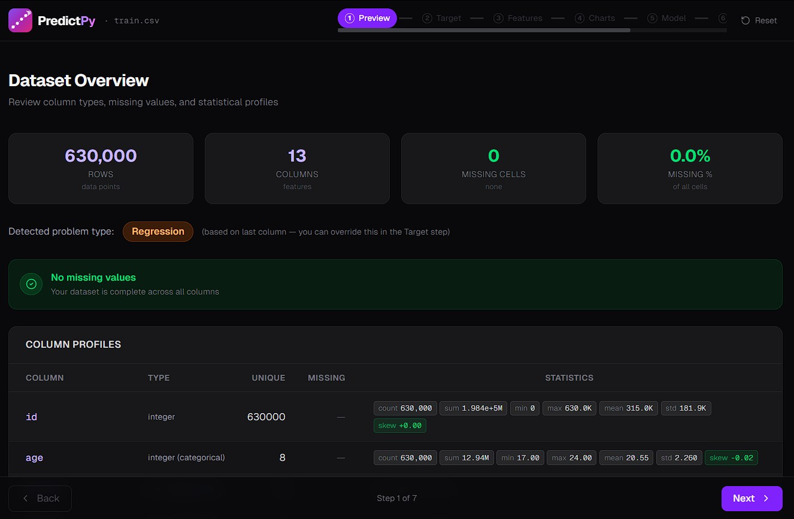
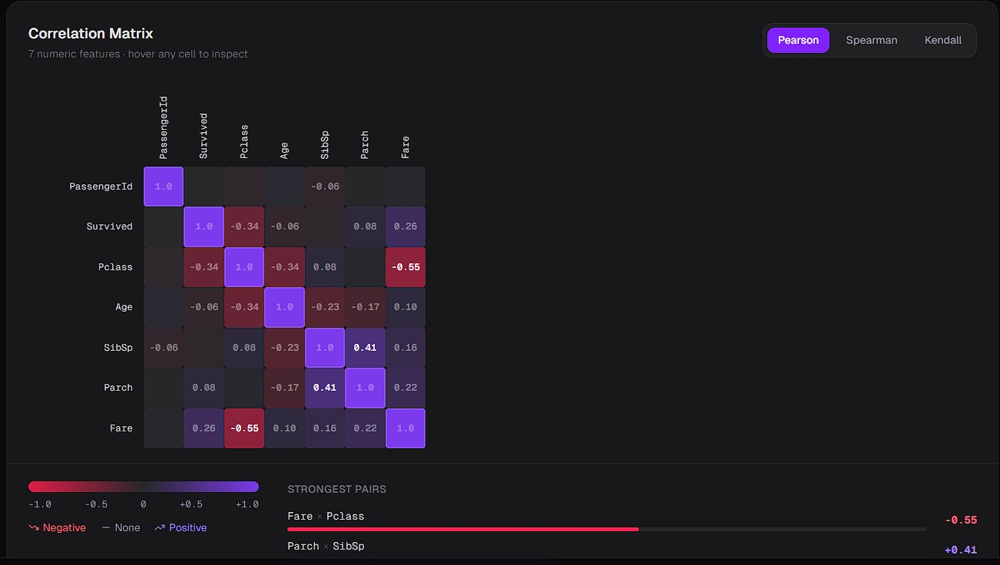
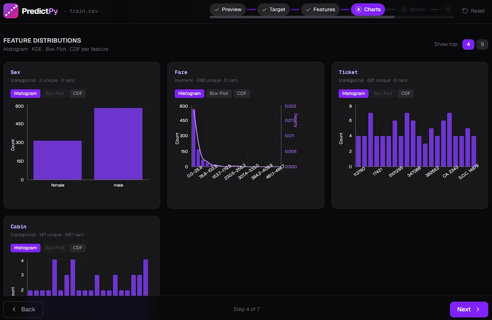
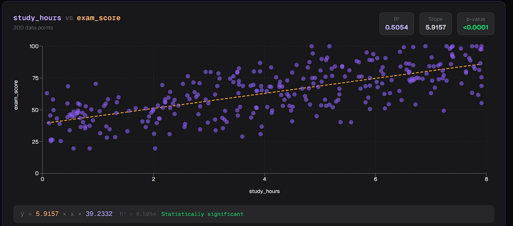
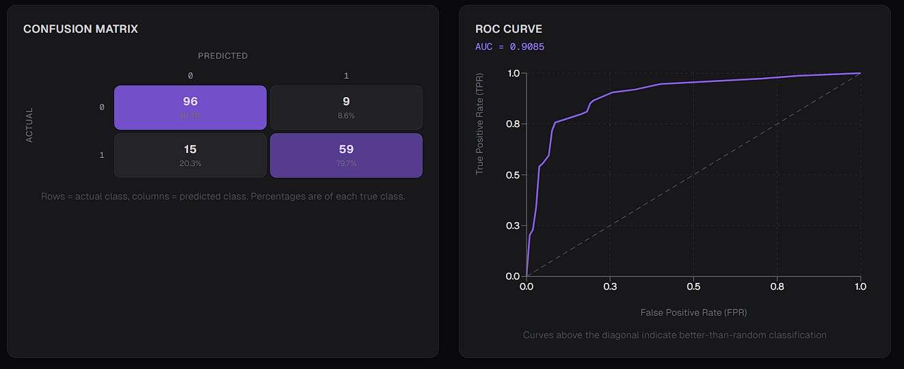
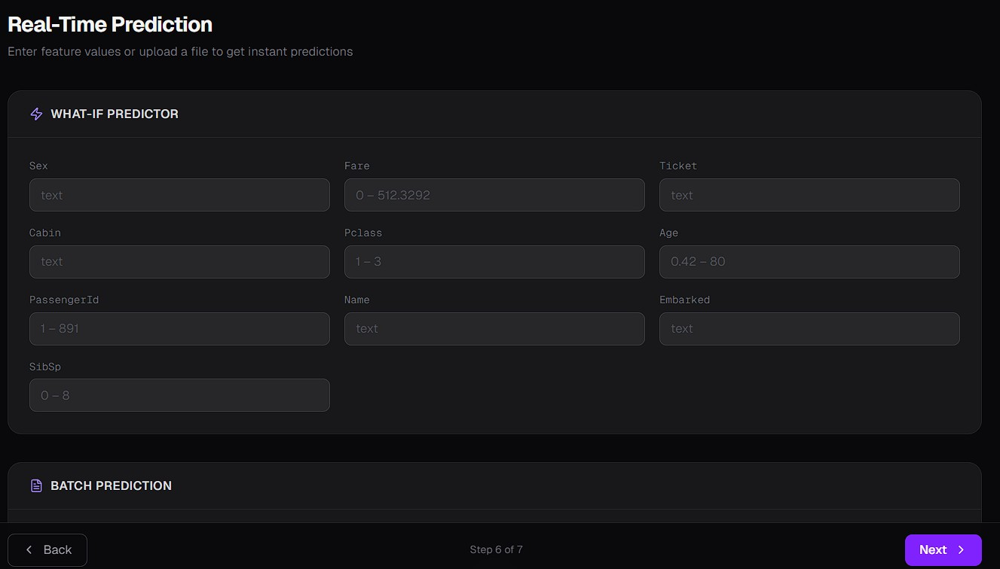

# PredictPy 🚀

**Intelligent ML feature selection and model training — in your browser.**

[](https://www.python.org/downloads/)
[](https://nextjs.org/)
[](https://opensource.org/licenses/MIT)

PredictPy is a code-free machine learning platform that automates the entire ML pipeline. Upload a dataset, and PredictPy will handle the profiling, feature ranking, model training, and evaluation—providing you with a production-ready `.pkl` file in minutes.

---

## 📸 Screenshots

<div align="center">
  
  <p><i>Comprehensive Data Profiling & Health Checks</i></p>

  <br />

  
  <p><i>Interactive Correlation Heatmaps (Pearson, Spearman, Kendall)</i></p>

  <br />

  
  <p><i>Deep-dive Feature Distributions & Sub-group Analysis</i></p>

  <br />

  
  <p><i>Interactive Scatter Plots with Real-time Regression Analysis</i></p>

  <br />

  
  <p><i>Advanced Model Evaluation: Confusion Matrix & ROC-AUC</i></p>

  <br />

  
  <p><i>Real-Time "What-If" Predictor & Batch Predictions</i></p>
</div>

---

## ✨ Key Features

### 📊 Exploratory Data Analysis (EDA)
- **Auto Problem Detection**: Instantly classifies your task as **Regression** or **Classification**.
- **Dataset Profiling**: Deep-dive into column types, missing values, skewness, kurtosis, and data quality.
- **Outlier Detection**: Automated IQR and Z-score analysis to identify anomalies.
- **Class Imbalance Alerts**: Multi-level warnings for classification datasets with severe skew.

### 🔍 Advanced Feature Selection
- **Multi-Method Ranking**: Features are ranked using a weighted ensemble of Pearson, Spearman, Mutual Information, ANOVA-F, Chi-Square, and Random Forest Importance.
- **Multicollinearity (VIF)**: Detect redundant features with color-coded Variance Inflation Factor (VIF) scores.
- **Auto-Selection (RFECV)**: Recursive Feature Elimination with Cross-Validation to find the optimal subset.
- **Feature Engineering**: Create derived features ($A \times B$, $A \div B$, etc.) directly in the UI.

### 🤖 Automated Model Training
- **Broad Model Support**: Train Linear/Ridge/LASSO, Logistic Regression, Random Forest, XGBoost, LightGBM, CatBoost, and complex Voting/Stacking ensembles.
- **Hyperparameter Tuning**: Integrated `RandomizedSearchCV` to optimize model parameters automatically.
- **Confidence Intervals**: 500-sample bootstrap intervals on all performance metrics.
- **Learning Curves**: Diagnose bias vs. variance with train/validation score plots across dataset sizes.

### 📈 Evaluation & Drift Detection
- **Comprehensive Visuals**:
  - **Regression**: Parity plots (actual vs. predicted) and Residual plots.
  - **Classification**: ROC-AUC curves, Confusion Matrices, and Calibration curves.
- **Data Drift Detection**: Integrated KS tests (numeric) and Chi-Square tests (categorical) to detect shifts between training and test distributions.

---

## 🛠 Tech Stack

| Component | Technology |
|---|---|
| **Frontend** | Next.js 16 (App Router), TypeScript, Tailwind CSS, Recharts, Zustand |
| **Backend** | FastAPI, Python 3.13, scikit-learn, SciPy, Statsmodels |
| **ML Engines** | XGBoost, LightGBM, CatBoost |

---

## 🎯 App Workflow

1. **Upload** 📂: Drop your CSV or Excel file.
2. **Preview** 👀: Inspect distribution stats and data health.
3. **Target** 🎯: Select your target column (or let AI suggest one).
4. **Features** 🧬: Rank features, check VIF, and select the best performers.
5. **Charts** 📊: Visualize relationships with heatmaps and scatter grids.
6. **Model** 🧠: Train, tune, and compare models with full metrics.
7. **Evaluate** ✅: Upload a holdout set to check performance and data drift.

## 🖥️ Server Setup — Linux (Ubuntu / Debian)

If you're deploying on a fresh Linux server (e.g. a VPS or cloud VM), install Docker and Docker Compose first.

### Step 1 — Update the system

```bash
sudo apt update && sudo apt upgrade -y
```

---

### Step 2 — Install Docker

```bash
curl -fsSL https://get.docker.com -o get-docker.sh
sh get-docker.sh
```

> This runs Docker's official convenience script and installs the latest Docker Engine automatically.

---

### Step 3 — Install Docker Compose

```bash
sudo curl -L "https://github.com/docker/compose/releases/download/1.29.0/docker-compose-$(uname -s)-$(uname -m)" -o /usr/local/bin/docker-compose
sudo chmod +x /usr/local/bin/docker-compose
docker-compose --version
```

> You should see output like `docker-compose version 1.29.0`. If so, you're ready to proceed.

---

Once Docker and Docker Compose are installed, continue with the Quick Start below.

---

## 🐳 Quick Start — Docker (Recommended)

Run PredictPy on your own machine with no Python or Node.js setup required.
Everything is built from source and served through an Nginx reverse proxy.

### Prerequisites

- Install **[Docker Desktop](https://www.docker.com/products/docker-desktop/)** for your OS (Windows / macOS / Linux)
- Make sure Docker Desktop is **running** before you proceed

---

### Step 1 — Clone the repository

```bash
git clone https://github.com/imdavidpaul/PredictPy.git
cd PredictPy
```

---

### Step 2 — Build and start

```bash
docker compose -f docker-compose.sandbox.yml up --build
```

Docker will build the backend and frontend images locally, then start three containers:
- `backend` — FastAPI on port 8000 (internal)
- `frontend` — Next.js on port 3000 (internal)
- `nginx` — Reverse proxy, the only public entry point (port 80)

> First build takes a few minutes. Subsequent starts (without `--build`) are instant.

---

### Step 3 — Open the app

Once you see all three containers running in the terminal, open your browser:

| Service | URL |
|---|---|
| **PredictPy App** | http://localhost |
| **API Docs (Swagger)** | http://localhost/api/docs |

All traffic is routed through Nginx on port 80 — no need to open separate ports.

---

### Step 4 — Stop the app

Press `Ctrl + C` in the terminal, then run:

```bash
docker compose -f docker-compose.sandbox.yml down
```

---

### Updating to the latest version

Pull the latest code and rebuild:

```bash
git pull
docker compose -f docker-compose.sandbox.yml up --build
```

---

### Troubleshooting

| Problem | Fix |
|---|---|
| Port 80 already in use | Stop any other app using port 80 (e.g. another web server), or restart Docker Desktop |
| `docker: command not found` | Docker Desktop is not installed or not running |
| App loads but API calls fail | Make sure all three containers are running: `docker ps` |
| Blank page on http://localhost | Wait 10–15 seconds after startup for the frontend to initialize |

---

## 🔨 Build from Source with Docker (Dev)

For contributors who want direct port access without Nginx (e.g. for debugging):

```bash
# Build images only (without starting containers)
docker compose build

# Build and start containers in one step
docker compose up --build

# Or use make shortcuts
make docker-build   # build only
make docker-up      # build + start (detached)
make docker-down    # stop and remove containers
```

This uses `docker-compose.yml` which exposes ports directly:

| Service | URL |
|---|---|
| **PredictPy App** | http://localhost:3000 |
| **API Docs (Swagger)** | http://localhost:8000/docs |

---

## 💻 Run Locally (Development)

For contributors or developers who want to run from source without Docker:

```bash
# Backend — terminal 1
cd backend
pip install -r requirements.txt
python -m uvicorn main:app --reload --port 8000

# Frontend — terminal 2
cd frontend
npm install
NEXT_PUBLIC_API_URL=http://localhost:8000 npm run dev
```

- Backend: http://localhost:8000
- Frontend: http://localhost:3000

> `NEXT_PUBLIC_API_URL` must be set explicitly for local dev — it defaults to `/api` which only works through the Nginx proxy.

---

## ⚖️ License

Distributed under the MIT License. See `LICENSE` for more information.
